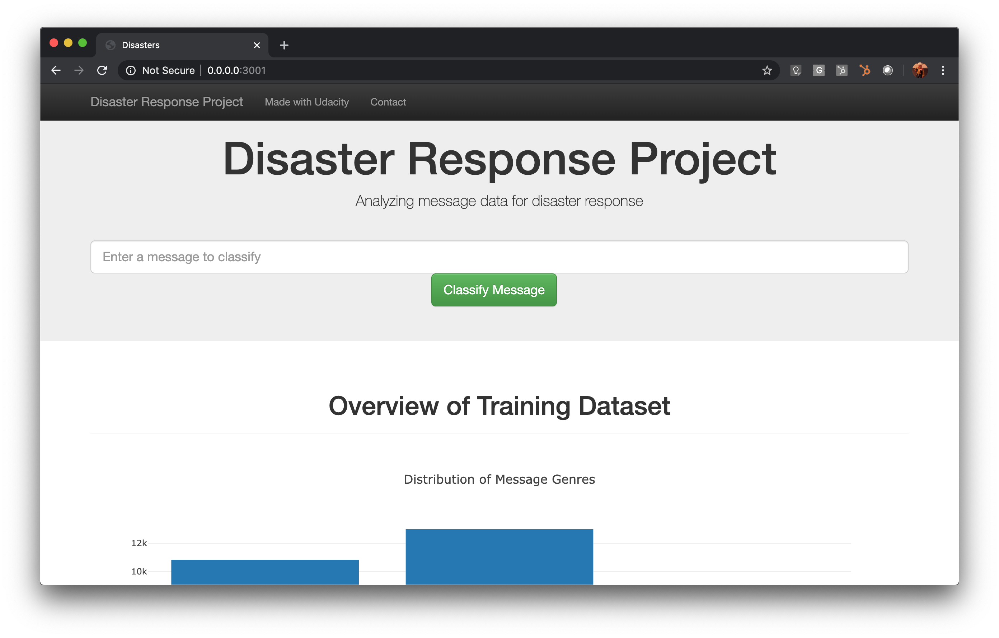

# Disaster Response Project
## Project Overview
In this project, we'll analyze disaster data from [Figure Eight](https://www.figure-eight.com/) to build a model for an API that classifies disaster messages into 36 categories.

The data set contain real messages that were sent during disaster events. This project creates a machine learning pipeline to categorize these events so that you can send the messages to an appropriate disaster relief agency.

The project includes a web app where an emergency worker can input a new message and get classification results in several categories.



The web app will also display visualizations of the data, as showed below.


And provide classification of new messages entered in the input field, as the text *"A ridge of water is coming. Need help! Trapped on iland"* as showed here;


## Project process
The project was a threefold challenge to build;  

1. Create a data pipeline is the Extract, Transform, and Load (ETL) process. Here, we read the dataset, clean the data, and then store it in a SQLite database. We do the data cleaning with pandas and then save the data into an SQLite database. The [ETL Pipeline Preparation](/data/ETL_Pipeline_Preparation.ipynb) was used to build the algoritms that afterwards was implemented in the [process_data.py](/data/process_data.py)

2. Create a Machine Learning (ML) Pipeline for training a classifier. Here we split the data into a training set and a test set. Then, we create a machine learning pipeline that uses NLTK, as well as scikit-learn's Pipeline and GridSearchCV to output a final model that uses the message column to predict classifications for 36 categories (multi-output classification). Finally, you will export your model to a pickle file. The [ML Pipeline Preparation](ML_Pipeline_Preparation.ipynb) notebook was used to build the algoritm, that was implemented in [train_classifier.py](/data/train_classifier.py) afterwards.

3. In the last step we modified a Flask webapp, with some visualizations and code to ensure the pipeline could be used to classifiy new messages.

## Project file structure

```
- app
| - template
| |- master.html  # main page of web app
| |- go.html  # classification result page of web app
|- figures.py # Functions to create plotly visuals
|- run.py  # Flask file that runs app

- data
|- disaster_categories.csv  # data to process
|- disaster_messages.csv  # data to process
|- DisasterResponse.db   # database to save clean data to
|- ETL_Pipeline_Preparation.ipynb # ETL preparation notebook
|- process_data.py # script to process data.

- models
|- train_classifier.py # script to train model
|- classifier.pkl  # ** saved model (needs to be unzipped)  

- environment.yml
- README.md

```
** **
Download [classifier.pkl here](https://www.dropbox.com/s/7vzqh1jhc8abnsf/classifier.pkl.zip?dl=0) unzip and place in folder as described above, or follow the steps below.
** **


## Instructions:

To test this on a mac;
1. use the environment.yml to create a conda environment.
2. download and Unzip the classifier.pkl file.
3. Run the following commands in the project's root directory to set up your database and model.

    - To run ETL pipeline that cleans data and stores in database
        `python data/process_data.py data/disaster_messages.csv data/disaster_categories.csv data/DisasterResponse.db`
    - To run ML pipeline that trains classifier and saves
        `python models/train_classifier.py data/DisasterResponse.db models/classifier.pkl`

2. Run the following command in the app's directory to run your web app.
    `python run.py`

3. Go to http://0.0.0.0:3001/

## Evaluating the scores

For this project the model training prints out score containing F1 score, Precision, Recall, and accuracy.

[This article](https://towardsdatascience.com/accuracy-precision-recall-or-f1-331fb37c5cb9) is relevant read for analyzing the scores.

Since this is disaster messages where the costs of having a mis-classified actual positive (or false negative) is relatively high, **accuracy** is maybe not the best measure.

As the article above mentions, **precision** is maybe a better measure when the costs of False Positive is high. Eg. If we are afraid of falsly classifying messages into categories. As this might create much more traffic on the relevant organizations as needed, this might be a better measure here.

**Recall** should, according to the article, be the model metric we use to select our best model when there is a high cost associated with False Negative. Eg. If we are afraid that we wrongly classify an emmergancy message to "no importance". This might be the best measure here, as we want to optimize for case where we actually spot messages that are from people in need of help.  
